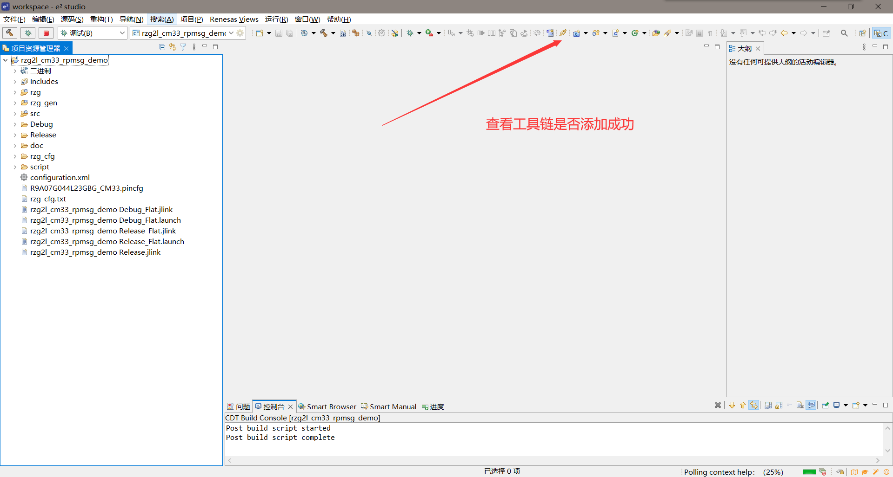
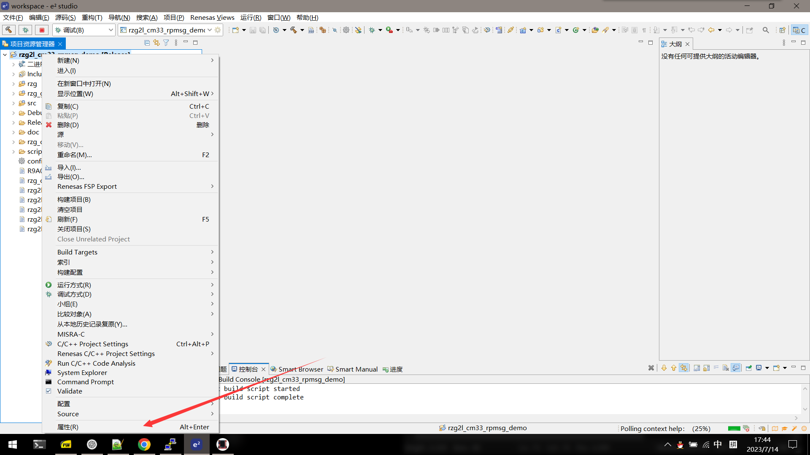
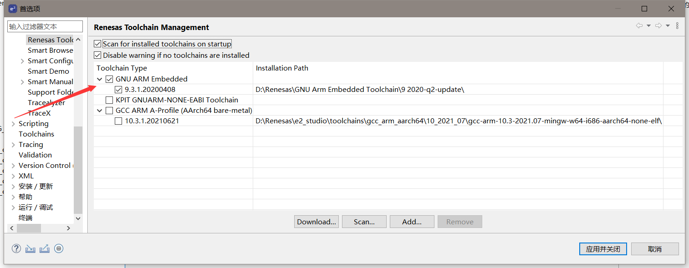

# 菜鸟笔记 - MYC_G2LX23-8E1D-120-I_LINUX 软件评估

## 开箱 😄

| 名称           | 主要参数                                      |
| -------------- | --------------------------------------------- |
| 主控芯片系列   | RZ/G2L                                        |
| 主控芯片型号   | R9A07G044L23GBG                               |
| 内存           | DDR4: 1                                       |
| 存储器         | eMMC: 8GB                                     |
| ARM 处理器规格 | X2 Cortex-A55、Cortex-M33、GPU、VPU           |
| 核心板尺寸     | 43mmx45mm                                     |
| 接口类型       | 邮票孔+LGA                                    |
| PCB 板规格     | 10 层板设计，沉金工艺生产                     |
| 主频           | A55 1.2GHz M33 200MHz                         |
| 视频输入       | MIPI CSI x 1 Parallel CSI x 1                 |
| 视频输出       | MIPI DSI x 1                                  |
| RGB 触摸屏     | 支持电容屏 支持四线式电阻屏（需外加触摸芯片） |
| 音频           | SSI x 4 SRC x 1                               |
| SD/MMC         | 1                                             |
| USB            | USB2.0 OTG x 1 USB2.0 HOST x 1                |
| 以太网         | 2 x RGMII                                     |
| UART           | SCIF x 5 SCI x 2                              |
| I2C            | 4                                             |
| CAN            | 2                                             |
| QSPI           | 2                                             |
| SPI            | 3                                             |
| ADC            | 8                                             |
| JTAG           | 1                                             |

## MYD-YG2LX 快速开发指南

- 按照图示连接开发板
- 将拨码开关设置为 0000
- 连接串口并在 PC 端打开上位机 Putty 配置串口波特率 115200
- 连接 12V 电源
- 打开 SW1 - 长按 ONOFF 开机

  > <div style="color: pink; font-weight: bold;">注意！！如果无法上电，请使用黄色的电源转接头</div>

- 此时便可看到出厂自带的 Linux 系统跑起来了 🤩

## 资料下载

[资料](down.myir-tech.com/MYD-YG2LX)

- 循序渐进，可以先只下载文档。按照文档熟悉本开发板，并按照 MYIR_G2LX23-8E1D-120-I_LINUX 软件评估 pdf 操作开发板。

## 环境准备

- 由于 MYC_G2LX23 系统出厂自带 Linux 系统，所以我们需要构建 Linux 环境：

  ### 1. 安装 VMware 搭建虚拟机 - Ubuntu

  - 新手入门，可以在 B 站看相关视频，推荐正点原子 [链接](https://www.bilibili.com/video/BV1vE411h7Fi?p=1)

  ### 2. 熟悉 Linux 常用命令

  在 Linux 系统中，熟悉常用命令是非常重要的，因为它们可以让您更有效地管理和操作系统。以下是一些常见的 Linux 命令以及它们的用途：

  - **`ls`**：列出当前目录中的文件和子目录。
  - **`cd`**：切换到其他目录。
  - **`pwd`**：显示当前工作目录的路径。
  - **`mkdir`**：创建新目录。
  - **`rm`**：删除文件或目录。
  - **`cp`**：复制文件或目录。
  - **`mv`**：移动文件或目录，也可用于重命名文件。
  - **`touch`**：创建新文件。
  - **`cat`**：显示文件内容。
  - **`grep`**：在文件中搜索指定文本。
  - **`ps`**：显示当前运行的进程。
  - **`kill`**：终止进程。
  - **`chmod`**：修改文件或目录的权限。
  - **`chown`**：更改文件或目录的所有者。
  - **`df`**：显示磁盘使用情况。
  - **`du`**：显示目录的磁盘使用情况。
  - **`top`**：实时监视系统性能和进程。

  您可以使用这些命令来管理文件、查看进程、监控系统性能等等。在深入学习 Linux 时，您还可以了解更多高级命令和选项，

## 测试

### 核心资源

1.  **CPU 打开 Putty，连接开发板，开启开发板。**

    终端显示表示进入系统：
    Last login: Fri Jan 1 00:49:32 UTC 2066
    sh: line 0: echo: write error: Invalid argument >>>PN=MYD-YG2L23-8E1D-120-I >>>PN=MYD-YG2L23-8E1D-120-I >>>SN=WK202305220010116▒ >>>SN=WK202305220010116▒
    smarc-rzg2l login: root (super user)
    root@myir-yg2lx:~#

2.  **输入命令 cd / 进入系统根目录**

        root@myir-yg2lx:/#

3.  **输入命令 cat proc/cpuinfo 读取系统中的 CPU 的提供商和参数信息.**

        processor       : 0
        BogoMIPS        : 48.00
        Features        : fp asimd evtstrm crc32 atomics fphp asimdhp cpuid asimdrdm lrcpc dcpop asimddp
        CPU implementer : 0x41
        CPU architecture: 8
        CPU variant     : 0x2
        CPU part        : 0xd05
        CPU revision    : 0

        processor       : 1
        BogoMIPS        : 48.00
        Features        : fp asimd evtstrm crc32 atomics fphp asimdhp cpuid asimdrdm lrcpc dcpop asimddp
        CPU implementer : 0x41
        CPU architecture: 8
        CPU variant     : 0x2
        CPU part        : 0xd05
        CPU revision    : 0

4.  **接下来进行其他核心资源的测试...**

    ### Cortex M33 通讯示例

    1.  **环境搭建: 下载 04_sources 文件并安装 e2s.**
    2.  **新建工作区并导入示例 demo**
    3.  **编译**

    - 如果编译报错，请查看编译链是否安装，配置成功。
    - 
    - 
    - 

    4.  **把 debug 生成的如下文件拷贝到 SD 卡上，用于在 uboot 进行 CM33 工程调用。**

5.  **插入 SD 卡会出现**

    root@myir-yg2lx:/# [ 1141.316960] mmc1: new high speed SDHC card at address b368
    [ 1141.323311] mmcblk1: mmc1:b368 NCard 29.1 GiB
    [ 1141.332309] mmcblk1: p1
    表明 SD 卡已经挂载。

6.  **开启或重启开发板，并在引导过程中按下适当的按键**
    - 如通常是“Enter”键或“Ctrl+C”组合键，以进入 U-Boot 命令行界面。
    - 提示符变为 `==>` 则进入成功。
7.  **在 U-Boot 命令行界面中，执行以下命令以查看 SD 卡中的内容：**

    - ls mmc 1:1

    - 输出内容为：
      > System Volume Information/
      > 400
      > rzg2l_cm33_rpmsg_demo_secure_code.bin
      > 64
      > rzg2l_cm33_rpmsg_demo_secure_vector.bin
      > 42160
      > rzg2l_cm33_rpmsg_demo_non_secure_code.bin
      > 1984
      > rzg2l_cm33_rpmsg_demo_non_secure_vector.bin

8.  **加载编译出来的固件，如下：**

    - `=> dcache off`
    - `=> mmc dev 1`
    - `switch to partitions #0, OK`
    - `mmc1 is current device`
    - `=> fatload mmc 1:1 0x0001FF80 rzg2l_cm33_rpmsg_demo_secure_vector.bin`
      64 bytes read in 12 ms (4.9 KiB/s)
    - `=> fatload mmc 1:1 0x42EFF440 rzg2l_cm33_rpmsg_demo_secure_code.bin`
      400 bytes read in 13 ms (29.3 KiB/s)
    - `=> fatload mmc 1:1 0x00010000 rzg2l_cm33_rpmsg_demo_non_secure_vector.bin`
      1984 bytes read in 13 ms (148.4 KiB/s)
    - `=> fatload mmc 1:1 0x40010000 rzg2l_cm33_rpmsg_demo_non_secure_code.bin`
      42160 bytes read in 18 ms (2.2 MiB/s)
    - `=> cm33 start_debug 0x1001FF80 0x00010000`
    - `=> dcache on`

    **启动开发板，如下：**

    - `=> run bootcmd`
    - `## Resetting to default environment`
    - `switch to partitions #0, OK`
    - `mmc1 is current device`

    **开发板成功启动后并进入到根文件系统，然后执行样例程序，如下：**

    - `root@myir-yg2lx:~# rpmsg_sample_client 1`
    - `metal: warning:`
    - `metal_linux_irq_handling: Failed to set scheduler: -1.`
    - `Successfully probed IPI device`
    - `metal: info:`
    - `metal_uio_dev_open: No IRQ for device 42f00000.rsctbl.`
    - `Successfully open uio device: 42f00000.rsctbl.`
    - `Successfully added memory device 42f00000.rsctbl.`
    - `metal: info:`
    - `metal_uio_dev_open: No IRQ for device 43100000.vring-ctl1.`
    - `Successfully open uio device: 43100000.vring-ctl1.`
    - `Successfully added memory device 43100000.vring-ctl1.`
    - `metal: info:`
    - `metal_uio_dev_open: No IRQ for device 43500000.vring-shm1.`
    - `...`
    - `sending payload number 471 of size 488`
    - `echo test: sent : 488`
    - `received payload number 471 of size 488`
    - `************************************`
    - `Test Results: Error count = 0`
    - `************************************`
    - `Quitting application .. Echo test end`
    - `Stopping application..`

由以上样例程序可知道，样例程序在等待 CA55 和 CM33 之间的通信通道建立后，CA55 示例程序开始向 CM33 发送消息，并将消息的大小从最小值 17 增加到最大值 488，当 CM33 接收到 CA55 发送的消息时并回送给 CA55。

**至此，完成协处理器的测试。接下来按照文档提示测试：**

- Memory test
- eMMC test
- RTC test
- Watchdog test
- EEPROM test
- Power Management
- ........

## C/C++ 编程环境搭建：

    C/C++是 Linux 平台下进行底层应用开发最为常用的编程语言，也是仅次于汇编的最为高效的语言。使用 C/C++ 进行开发通常采用的是交叉开发的方式，即在开发主机端进行开发，编译生成目标机器上运行的二进制执行文件，然后部署到目标机器上运行。采用这种方式，首先需要安装基于 Yocto 构建的 SDK，安装步骤请参见《MYD-YG2LX_Linux 软件开发指南》，安装完成后需要配置一下 SDK 环境。

1.  **下载：03-Tools/Toolchains/sdk.tar.bz2.上传到自己的 Ubuntu 虚拟环境。**
2.  **安装并测试 SDK，通过 FileZilla 将 03-Tools/Toolchains/sdk.tar.bz2.上传到自己的虚拟机。使用 tar 解压缩并安装 core_full。**
     -安装指令：
    > ./poky-glibc-x86_64-myir-image-full-aarch64-myir-yg2lx-toolchain-3.1.20.sh
3.  **选择安装路径（默认 opt/poky/3.1.20，也可以根据提示自己选择合适的目录）下面以 /opt/yg2lx 目录为例，具体可根据提示进行操作：**
    > PC:~/yg2lx-sdk$ ./poky-glibc-x86_64-myir-image-full-aarch64-myir-yg2lx-toolcha
    > in-3.1.20.sh# Poky (Yocto Project Reference Distro) SDK installer version 3.1.20
    > Enter target directory for SDK (default: /opt/poky/3.1.20): /opt/yg2lx
    > You are about to install the SDK to "/opt/yg2lx". Proceed [Y/n]? y
4.  **测试 SDK**
    - 添加环境变量：
      >     source /opt/yg2lx/environment-setup-aarch64-poky-linux
    - 测试 ：
      > $CC -v
5.  **编写 C/C++程序**
    ```c
    // File: hello.c
    #include <stdio.h>
    int main(int argc, char *argv[])
    {
    	printf("hello world!\n");
    	return 0;
    }
    ```
6.  **编译**

    > $CC -v hello.c -o hello

7.  **通过 scp 命令把生成的执行文件拷贝到目标机器上执行（不会）**
    - 可以传到 SD 卡上然后运行
      > 结果如下：
      > root@myir-yg2lx:/# ./hello
      > hello world!
      > root@myir-yg2lx:/# ./hello-CXX
      > hello world!

# 裸机开发

1. ## 系统配置和启动 ##
   > MYC-YG2LX 核心板支持 3 种启动媒介：串口下载、EMMC 启动和 SPI FLASH 启动。
